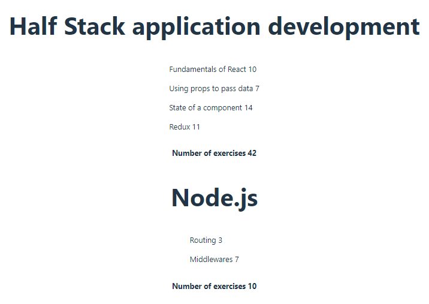

# CourseInfo

## Part 1
- Init new application
- Delete boilerplate files
- Edit `App.js` to match the following:

```js
const App = () => {
  const course = 'Half Stack application development'
  const part1 = 'Fundamentals of React'
  const exercises1 = 10
  const part2 = 'Using props to pass data'
  const exercises2 = 7
  const part3 = 'State of a component'
  const exercises3 = 14

  return (
    <div>
      <h1>{course}</h1>
      <p>
        {part1} {exercises1}
      </p>
      <p>
        {part2} {exercises2}
      </p>
      <p>
        {part3} {exercises3}
      </p>
      <p>Number of exercises {exercises1 + exercises2 + exercises3}</p>
    </div>
  )
}

export default App
```

- Refactor `App.js` into components so that it has this structure:

```js
const App = () => {
  // const-definitions

  return (
    <div>
      <Header course={course} />
      <Content ... />
      <Total ... />
    </div>
  )
}
```

- Refactor variable definitions so everything is in one `course` object:

```js
const App = () => {
  const course = {
    name: 'Half Stack application development',
    parts: [
      {
        name: 'Fundamentals of React',
        exercises: 10
      },
      {
        name: 'Using props to pass data',
        exercises: 7
      },
      {
        name: 'State of a component',
        exercises: 14
      }
    ]
  }

  return (
    <div>
      ...
    </div>
  )
}
```

### Preview


## Part 2

- Refactor app to use this:

```js
const courses = [
  {
    name: 'Half Stack application development',
    id: 1,
    parts: [
      {
        name: 'Fundamentals of React',
        exercises: 10,
        id: 1
      },
      {
        name: 'Using props to pass data',
        exercises: 7,
        id: 2
      },
      {
        name: 'State of a component',
        exercises: 14,
        id: 3
      },
      {
        name: 'Redux',
        exercises: 11,
        id: 4
      }
    ]
  }, 
  {
    name: 'Node.js',
    id: 2,
    parts: [
      {
        name: 'Routing',
        exercises: 3,
        id: 1
      },
      {
        name: 'Middlewares',
        exercises: 7,
        id: 2
      }
    ]
  }
]
```

- Create `course` component to display each course details using previous components
- Us

