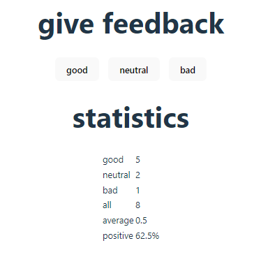

# Part 1: Unicafe exercise

> Your task is to implement a web application for collecting customer feedback. There are only three options for feedback: good, neutral, and bad.

> The application must display the total number of collected feedback for each category, the average score (good: 1, neutral: 0, bad: -1) and the percentage of positive feedback.

- Display values of:
  - good feedback
  - neutral feedback
  - bad feedback
  - total feedback
  - average score (good: 1, neutral: 0, bad: -1)
  - positive percentage

- Refactor stats into its own components
- Display stats only when feedback is gathered (otherwise display "No feedback given" message)
- Display stats in an HTML table

## Preview

